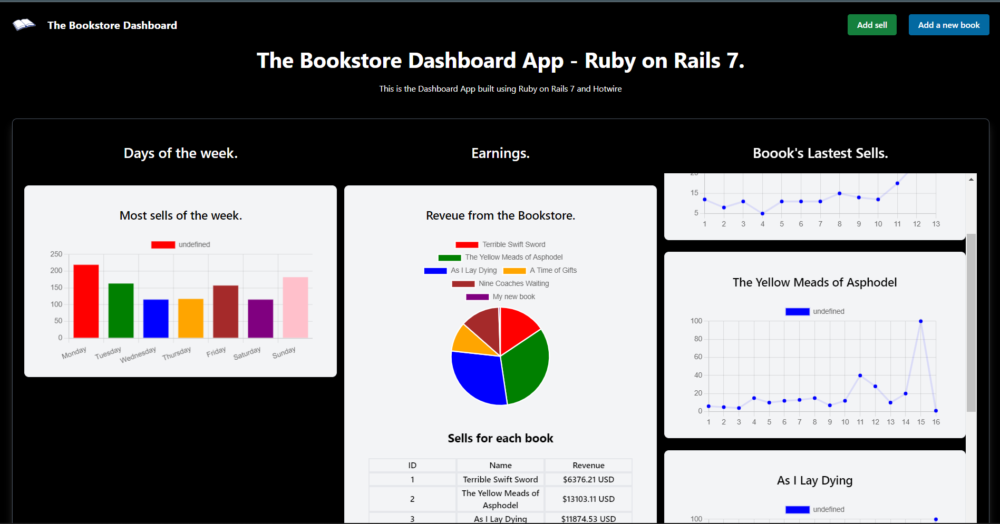

# The Bookstore Dashboard App.

This is the Bookstore Dashboard App. This web application was built with Ruby on Rails 7 and Hotwire.

## Description

You can cereate books with their names and prices. Each book has sells, and this sells can be added inside the nav bar.
Once the user creates a book, a new chart is created to show the book's latest sells. If the user creates a new sell, the days chart
and the revenue chart will be updated, showing the lates sells by days and the total erevenue by book and by all books.

## Demo.

This is the demo of the Bookstore Dashboard App.

  

## Images.

An overview of the Bookstore Dashboard App.

  

## Software and technologies

* Ruby on Rails.
* PostgreSQL.
* Docker.
* Hotwire.
* TailwindCSS.

## Schema database and tables.

* Books.
* Sells.

## Author.

* Jorge Ortiz.
* Software engineer.
* San Luis Potosí, S.L.P. México.
